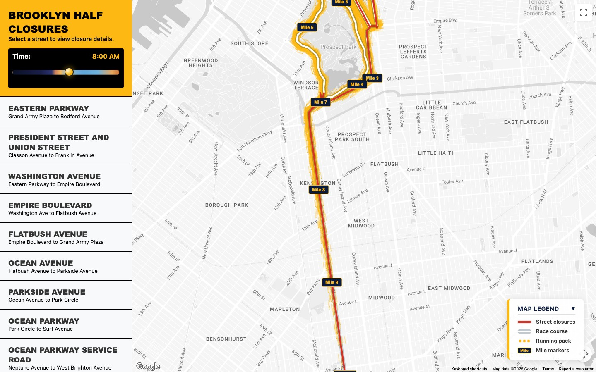

# Brooklyn Half Marathon Road Closures Map

An interactive map for the **Brooklyn Half Marathon** that shows street closures, re-openings, and the runner pack moving along the course in real time. Scrub the time slider to see what the neighborhood looks like at any moment between 4 AM and 1 PM on race day — so you can plan around the 25,000+ runners coming through.

Live site: [brooklyn-half-2026-map.vercel.app](https://brooklyn-half-2026-map.vercel.app/)



## What it does

- **Time-scrubbing closures.** A slider drives the whole view from the pre-race lockdown (4 AM) through the final re-opening. Each street segment turns red when its closure window starts and fades back to gray as it reopens.
- **The runner swarm.** A continuous, physics-based particle simulation models the pack — front of the pack, the bulge in the middle, and the trailing tail — moving along the course based on the 2025 NYRR finisher pace distribution.
- **Mile markers and course ribbon.** The official 13.1-mile route is drawn as a white-on-navy ribbon with numbered mile badges.
- **Closure list with details.** Click any street in the sidebar to see its closure window, no-parking window, and exact segment.


## How it works

The app is plain HTML/CSS/JS — no build step beyond a one-liner that writes the Google Maps API key into `config.js`.

- `index.html` — page shell, sidebar, onboarding overlay, legend.
- `app.js` — map setup, time slider, closure rendering, runner swarm physics.
- `data.js` — closure data (street, segment, closure window, lat/lng path).
- `fetch_results.py` — one-off script that scraped the 2025 NYRR finisher results to calibrate the pace distribution used by the swarm.

## Running locally

```sh
# 1. Put your Google Maps JS API key in a .env file
echo "GOOGLE_MAPS_API_KEY=your_key_here" > .env

# 2. Generate config.js from the env var
export $(cat .env | xargs) && npm run build

# 3. Serve
npm run dev
```

Then open the URL `npx serve` prints (usually `http://localhost:3000`).

## Deploying

Deployed on Vercel. The `build` script reads `GOOGLE_MAPS_API_KEY` from Vercel project env vars and writes `config.js` at build time. `vercel.json` serves the repo root as a static site.
